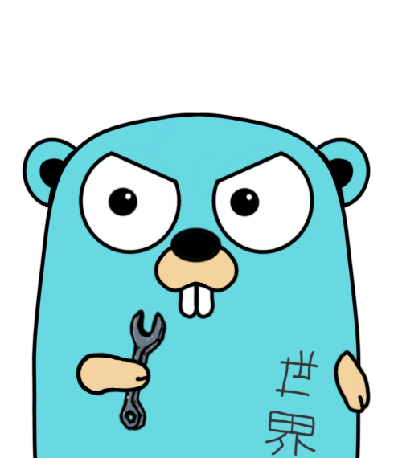

# Challenger
High frequency trading engine, for executing price arbitrage across various cryptocurrency exchanges. 

## Tools:
* Apache Cassandra
* Apache Kafka
* Go
* Monster Energy Drink

# System design
The High Frequency Trading Engine (HFTE) demands incredible performance in handling a high volume of data. The backend is tasked with managing multiple websocket connections concurrently, which continuously stream market relevant. This architectural requirement significantly influences our choice of database technology, primarily due to the expected predominance of write operations over read operations.

## Database
To tackle this architectural challenge, the perisistence of choice will be [Apache Cassandra](https://cassandra.apache.org/_/index.html). Cassandra is known for handling write-heavy operations really well, and also it's ability to scale horizontally.

## Messaging
Furthermore, there will be a need for the producer and consumer to scale indepndently. We expect there to be a high throughput of market data, and we can not guarantee the backend will survive all the backpreassure. We also have a need of logically grouping order data, and be able to continiously stream the data into our backend for furhter processing. To handle this challenge, and the incredible performance provided by [Apache Kafka](https://kafka.apache.org/) we will be able to do some well designed topics and stream different kinds of data.

The system is pretty simple, I don't expect it to run in the cloud but it might. This is more for the challenge and learning more about how distributed systems are screwed together.

